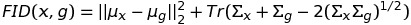
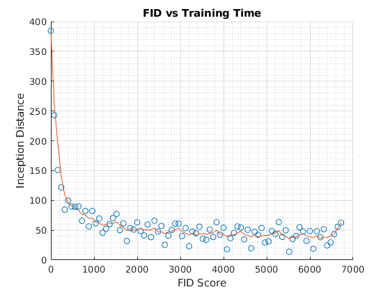

## StyleGan2 Notes

### Evaluation GANs

How to track the performance of a Generative Model? Well, one way to do that is to use something known as the 
Frechet Inception Distance score.  

`$$FID(x,g)=||\mu_x -\mu_g||_2^2+Tr(\Sigma_x+\Sigma_g-2(\Sigma_x\Sigma_g)^{1/2})$$`

The original [paper](https://arxiv.org/abs/1706.08500) proposed the FID score as a way of comparing the quality of generated and real images. In short, the FID score compares feature level distributions drawn from real and generated imagery to determine if the generated imagery has a similiar distribution in terms of diversity and quality. Feature level means that a vector drawn from an intermediate layer of the network is used to generate a sample.

For our model, we can look at how our FID score improves over time:

`
  Plot Info:
  
  Model Resolution: 256x256
  
  Config-f
`

### Training GANs

