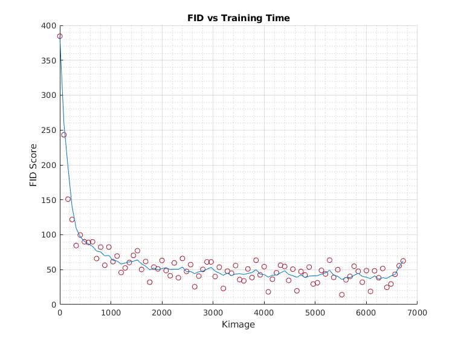

## StyleGan2 Notes

### Evaluating GANs

How to track the performance of a Generative Model? Well, one way to do that is to use something known as the 
Frechet Inception Distance score.  


The original [paper](https://arxiv.org/abs/1706.08500) proposed the FID score as a way of comparing the quality of generated and real images. In short, the FID score compares feature level distributions drawn from real and generated imagery to determine if the generated imagery has a similiar distribution in terms of diversity and quality. Feature level means that a vector drawn from an intermediate layer of the network is used to generate a sample.

For our model, we can look at how our FID score improves over time:



```
  Plot Info
  Infrastructure: Single Node 8 x GPU (2 Days Training)
  Model Resolution: 256x256
  Config-f
```

### Training GANs

### Early Interpolation Results

Interpolation created from model trained for approx. 7 days on 1024x1024 imagery from the Chesapeake Conservancy LU/LC data. These gifs were created on a snapshot of the network after training on 11714 images.

Start and end images were randomly selected as proof of concept. In the future, we wish to generate interpolations between current imagery and imagery generated to align with predictions produced by climate change models.


